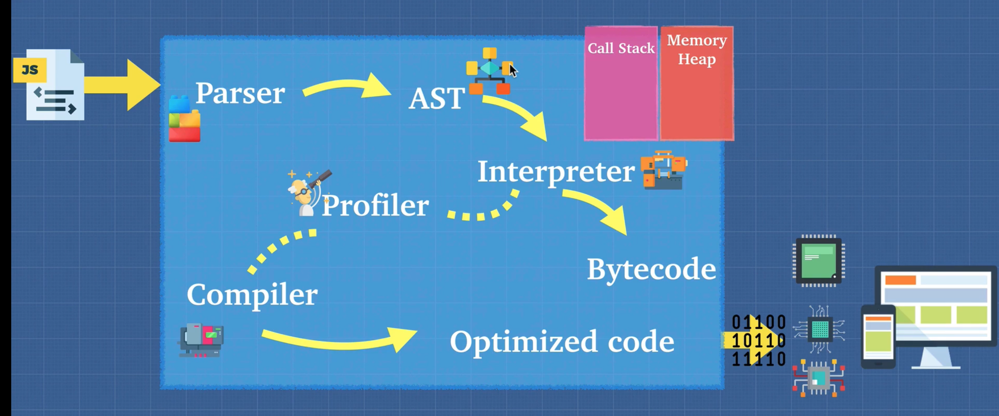

### 面试准备

#### 1.模块化规范

前端主流的模块化标准有：
- CommonJS：Node.js 用的就是 CommonJS 模块化规范，通过 require 方法同步加载所依赖的模块，通过 exports 或 module.exports 导出需要暴露的数据。
- AMD：Asynchronous Module Definition，异步模块定义，通过 define 方法定义模块，通过 require 方法异步加载模块，依赖前置。
- CMD：Common Module Definition，通用模块定义，通过 define 方法定义模块，通过 require 方法异步加载模块，依赖就近。
- UMD：Universal Module Definition，通用模块定义，兼容 CommonJS、AMD 和全局变量三种方式。
- ES6：ES6 提供了原生的模块化语法，通过 import 和 export 关键字来导入和导出模块。
这些模块化规范各有优缺点和适用场景，您可以根据您的需求和喜好选择合适的规范。
源: 与必应的对话， 2023/4/24
(1) 前端模块化规范详细总结 - 掘金 - 稀土掘金. https://juejin.cn/post/6996595779037036580 访问时间 2023/4/24.
(2) 一文彻底搞懂JS前端5大模块化规范及其区别 - Echoyya、 - 博客园. https://www.cnblogs.com/echoyya/p/14577243.html 访问时间 2023/4/24.
(3) 前端模块化(CommonJS、AMD、CMD、ES6模块化区别)_LYFlied的博客-CSDN博客. https://blog.csdn.net/qq_39903567/article/details/115325717 访问时间 2023/4/24.
(4) 前端模块化(CommonJS、AMD、CMD、ES6模块化区别)_LYFlied的博客-CSDN博客. https://bing.com/search?q=%e5%89%8d%e7%ab%af%e7%9a%84%e6%a8%a1%e5%9d%97%e5%8c%96%e8%a7%84%e8%8c%83 访问时间 2023/4/24.

#### 2.在什么场景下会用到 pinia

根据网络搜索结果¹²³，pinia 是一个 Vue.js 的状态管理库，它允许你在组件或页面之间共享一个状态。如果你熟悉 Vue.js 的组合式 API，你可能会认为你已经可以通过一个简单的 export const state = reactive({}) 来共享一个全局状态。但是 pinia 还提供了一些额外的优点，比如：
- 类型安全：pinia 可以自动推断出 store 的类型，即使在 JavaScript 中也可以提供自动补全功能。
- 可扩展性：pinia 可以通过响应 store 的变更来扩展其功能，比如实现事务、同步本地存储等。
- 模块化设计：pinia 允许你创建多个 store，并让你的打包工具自动拆分它们。
- 开发工具支持：pinia 可以与 Vue devtools 集成，让你在 Vue 2 和 Vue 3 中都能享受到更好的开发体验。
所以，如果你正在使用 Vue.js 开发一个复杂的应用，并且想要一个轻量、符合直觉、易于组织的状态管理库，那么 pinia 可能是一个不错的选择。
源: 与必应的对话， 2023/4/24

(1) Pinia | The intuitive store for Vue.js. https://pinia.vuejs.org/ 访问时间 2023/4/24.
(2) Pinia | The intuitive store for Vue.js. https://pinia.vuejs.org/zh/ 访问时间 2023/4/24.
(3) Introduction | Pinia - Vue.js. https://pinia.vuejs.org/introduction.html 访问时间 2023/4/24.

#### 3.写一个 Promise.all 的示例

根据网络搜索结果¹³⁵，Promise.all 是一个方法，它接收一个 promise 的可迭代对象作为参数，返回一个新的 promise 对象。当所有的 promise 都成功完成时，新的 promise 会以一个数组的形式返回所有 promise 的结果。如果有任何一个 promise 失败了，新的 promise 会立即失败，并返回第一个失败的原因。Promise.all 可以用来等待多个异步操作的完成，或者并行执行多个异步任务。Promise.all 的示例代码如下：

```js

console.time();
var p1 = new Promise(function (resolve, reject) {
  setTimeout(function () {
    resolve(1);
  }, 1000);
});
var p2 = new Promise(function (resolve, reject) {
  setTimeout(function () {
    resolve(2);
  }, 2000);
});
var p3 = new Promise(function (resolve, reject) {
  setTimeout(function () {
    resolve(3);
  }, 3000);
});

// 使用 Promise.all 等待三个异步任务都完成
Promise.all([p1, p2, p3]).then(function (values) {console.timeEnd();//3000左右
  // values 是一个数组，包含了三个异步任务的结果
  console.log(values); // [1, 2, 3]
}).catch(function (error) {
  // 如果有任何一个异步任务失败了，就会进入这个回调函数，并打印出失败的原因
  console.error(error);
});

```
// 创建三个异步任务，分别在 1 秒、2 秒和 3 秒后完成，并返回一个数字


源: 与必应的对话， 2023/4/24

(1) Promise.all等待所有Promise执行完成 - CSDN博客. https://blog.csdn.net/mouday/article/details/106130978 访问时间 2023/4/24.
(2) Promise.all( ) 的使用 - lcspring - 博客园. https://www.cnblogs.com/lcspring/p/11169295.html 访问时间 2023/4/24.
(3) Javascript Promise.all()用法及代码示例 - 纯净天空. https://vimsky.com/examples/usage/javascript-promise-all-method.html 访问时间 2023/4/24.
(4) Promise.all() - JavaScript | MDN - Mozilla Developer. https://developer.mozilla.org/zh-CN/docs/Web/JavaScript/Reference/Global_Objects/Promise/all 访问时间 2023/4/24.
(5) 对Promise.all执行顺序的深入理解 - 知乎 - 知乎专栏. https://zhuanlan.zhihu.com/p/93889764 访问时间 2023/4/24.

#### 4.promise还有什么api
根据网络搜索结果¹²，promise 是一个表示异步操作的最终完成或失败的对象。promise 有以下几个常用的 API：

- Promise.prototype.then()：用于给 promise 添加成功或失败的回调函数，返回一个新的 promise 对象。
- Promise.prototype.catch()：用于给 promise 添加失败的回调函数，返回一个新的 promise 对象。
- Promise.prototype.finally()：用于给 promise 添加无论成功或失败都会执行的回调函数，返回一个新的 promise 对象。
- Promise.all()：用于等待一组 promise 都完成或有一个失败时返回一个新的 promise 对象，其结果是一个包含所有 promise 结果的数组或第一个失败的原因。
- Promise.race()：用于等待一组 promise 中第一个完成或失败时返回一个新的 promise 对象，其结果是第一个完成或失败的结果。
- Promise.any()：用于等待一组 promise 中第一个完成时返回一个新的 promise 对象，其结果是第一个完成的结果。如果所有 promise 都失败了，则返回一个 AggregateError 对象。
- Promise.allSettled()：用于等待一组 promise 都结束（无论成功或失败）时返回一个新的 promise 对象，其结果是一个包含所有 promise 状态和结果的数组。
- Promise.resolve()：用于创建一个已经成功完成的 promise 对象，其结果是指定的值。
- Promise.reject()：用于创建一个已经失败的 promise 对象，其原因是指定的值。

源: 与必应的对话， 2023/4/24

(1) Promise - JavaScript | MDN - Mozilla Developer. https://developer.mozilla.org/en-US/docs/Web/JavaScript/Reference/Global_Objects/Promise 访问时间 2023/4/24.
(2) Promise API - JavaScript. https://javascript.info/promise-api 访问时间 2023/4/24.
(3) Using promises - JavaScript | MDN - Mozilla Developer. https://developer.mozilla.org/en-US/docs/Web/JavaScript/Guide/Using_promises 访问时间 2023/4/24.
(4) .promise() | jQuery API Documentation. https://api.jquery.com/promise/ 访问时间 2023/4/24.

要在 TypeScript 中正确使用 Promise 的 any 方法，您需要遵循以下步骤：  
1. 定义一个 Promise 数组，该数组将包含多个 Promise 对象。  
2. 使用 Promise.any 方法等待任何一个 Promise 对象解决。  
3. 处理解决的 Promise 对象的结果。  
下面是一个示例：  
```ts
const promises = [
  Promise.resolve('hello'),
  Promise.reject(new Error('world')),
  Promise.resolve('!'),
];

Promise.any(promises)
  .then((result) => {
    console.log(result); // 输出 'hello'
  })
  .catch((error) => {
    console.error(error); // 输出 'AggregateError: All promises were rejected'
  });

```

在上面的示例中，我们首先定义了一个包含三个 Promise 对象的数组 promises，然后使用 Promise.any 方法等待任何一个 Promise 对象解决。由于第一个 Promise 对象解决了，因此 Promise.any 方法返回了该 Promise 对象的结果 'hello'。    
如果您需要更多关于 Promise 的 any 方法的信息，可以查看 [MDN 文档](https://developer.mozilla.org/en-US/docs/Web/JavaScript/Reference/Global_Objects/Promise/any)。

#### 5.v8引擎是如何工作的

已发送电子邮件. v8引擎是如何工的
根据网络搜索结果¹²，V8 引擎是 Google 开发的一款高性能的 JavaScript 和 WebAssembly 引擎，它可以将 JavaScript 代码编译成机器码并执行。V8 引擎的工作原理大致如下：

- V8 引擎首先使用一个叫做 **Ignition** 的字节码解释器，将 JavaScript 代码解析成一种中间表示，叫做字节码。字节码是一种比机器码更简单、更紧凑的指令集，它可以在不同的 CPU 架构上运行，而不需要针对每种架构重新编译。
- V8 引擎在解释执行字节码的过程中，使用一个叫做 **TurboFan** 的优化编译器，对一些频繁执行的热点代码进行优化。TurboFan 可以利用字节码中的类型信息和执行反馈，对代码进行各种优化，比如内联、循环展开、死代码消除等，然后生成高效的机器码。
- V8 引擎在执行优化后的机器码的过程中，使用一个叫做 **OSR** (on-stack replacement) 的技术，实现从字节码到机器码的无缝切换。这样就可以在不影响执行流程的情况下，提升代码的性能。
- V8 引擎还使用了一个叫做垃圾回收器 (**garbage collector**) 的组件，负责管理内存的分配和释放。V8 引擎使用了分代式垃圾回收算法，将内存分为新生代和老生代两部分，分别采用不同的回收策略。新生代内存中存放的是生命周期较短的对象，使用复制算法进行回收。老生代内存中存放的是生命周期较长的对象，使用标记-清除和标记-整理算法进行回收。V8 引擎还使用了增量标记和并发标记等技术，减少垃圾回收对执行的影响。

源: 与必应的对话， 2023/4/24(1) 深入理解 JavaScript 的 V8 引擎

(1) - 知乎 - 知乎专栏. https://zhuanlan.zhihu.com/p/389319890 访问时间 2023/4/24.
(2) Google V8 引擎工作原理（翻译） - 掘金 - 稀土掘金. https://juejin.cn/post/6844903640616943623 访问时间 2023/4/24.
(3) V8发动机 - 百度百科. https://baike.baidu.com/item/V8发动机/280551 访问时间 2023/4/24.



ast explorer

<iframe src="https://astexplorer.net/" style="width:100%;height:600px"></iframe>


你可以这样理解 js 中的解释器和编译器：
- 解释器 **interpreter** 是一种程序，它可以边读取 js 代码，边翻译成机器可执行的指令，边执行。解释器的优点是可以快速启动和执行代码，缺点是相同的代码可能被重复翻译和执行，效率较低。
- 编译器 **complier** 是另一种程序，它可以提前将 js 代码翻译成机器可执行的指令，并生成一个可执行文件。编译器的优点是可以避免重复翻译和执行，并且可以在编译过程中对代码进行优化，缺点是需要提前编译，不能动态执行。
- js 最初是一种解释型语言，但后来为了提高性能，浏览器引入了 JIT（即时编译）技术，它结合了解释器和编译器的优点，可以动态地将热点代码（经常执行的代码）编译成机器指令，并缓存起来，从而提高运行速度。

源: 与必应的对话， 2023/4/24

(1) JavaScript 编译 - JIT (just-in-time) compiler 是怎么工作的 - 知乎. https://zhuanlan.zhihu.com/p/99395691 访问时间 2023/4/24.
(2) 实现JavaScript语言解释器（一） - 知乎 - 知乎专栏. https://zhuanlan.zhihu.com/p/269798069 访问时间 2023/4/24.
(3) 编译原理：从0写一个js解释器 - 知乎 - 知乎专栏. https://zhuanlan.zhihu.com/p/137509746 访问时间 2023/4/24.

[状态机和状态图简介 | XState 文档](https://xstate.js.org/docs/zh/guides/introduction-to-state-machines-and-statecharts/#%E5%A4%8D%E5%90%88%E7%8A%B6%E6%80%81-compound-states)


### 6.用js实现有限状态机

根据网络搜索结果¹³，你可以这样用 js 实现一个有限状态机：

- 引入一个有限状态机的函数库，如 XState 或 Javascript Finite State Machine。
- 定义一个有限状态机的配置对象，包括初始状态，可能的状态，以及触发状态转换的事件和回调函数。
- 使用 createMachine 或 StateMachine.create 方法，根据配置对象创建一个有限状态机的实例。
- 使用 interpret 或 StateMachine.create 方法，创建一个状态机的服务，用来解释和执行状态机的逻辑。
- 使用 send 方法，向状态机发送事件，触发状态转换和相应的动作。
- 使用 current 或 value 属性，获取当前的状态。
- 
(1) XState 文档 - js. https://xstate.js.org/docs/zh/ 访问时间 2023/4/24.
(2) 前端状态机：XState 首个中文文档上线了 - 掘金. https://juejin.cn/post/7041081378745630757 访问时间 2023/4/24.
(3) JavaScript与有限状态机 - 阮一峰的网络日志 - Ruan YiFeng. https://www.ruanyifeng.com/blog/2013/09/finite-state_machine_for_javascript.html 访问时间 2023/4/24.
(4) JavaScript中有限状态机的简介 - 掘金 - 稀土掘金. https://juejin.cn/post/7173290115769319461 访问时间 2023/4/24.